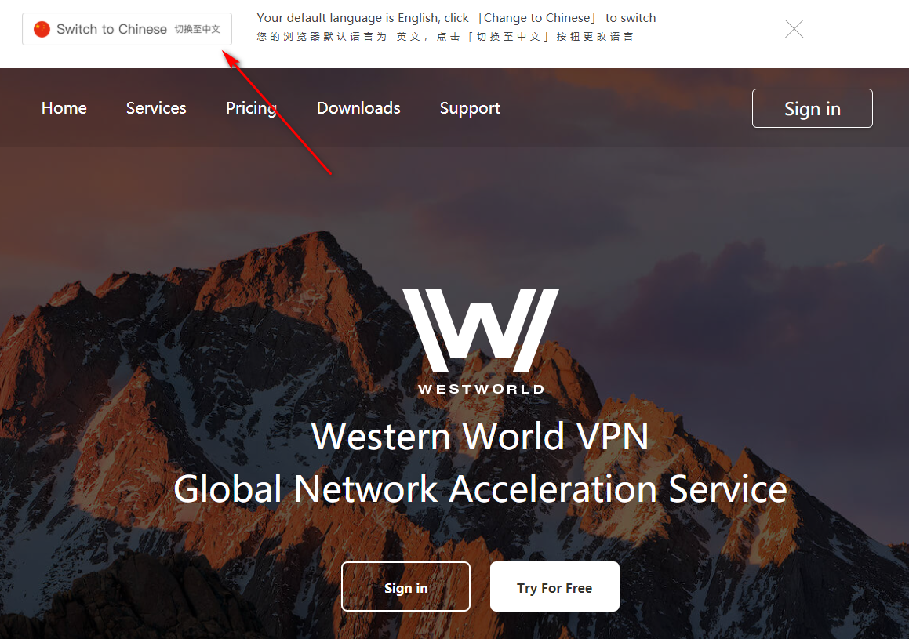
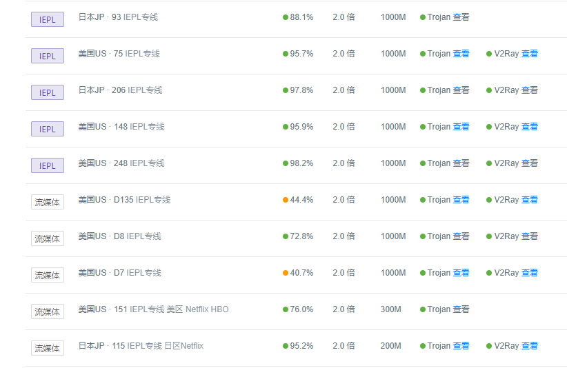
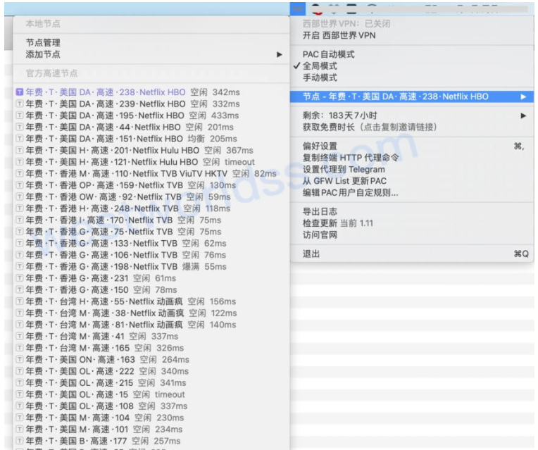
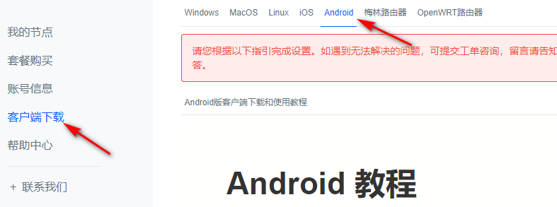
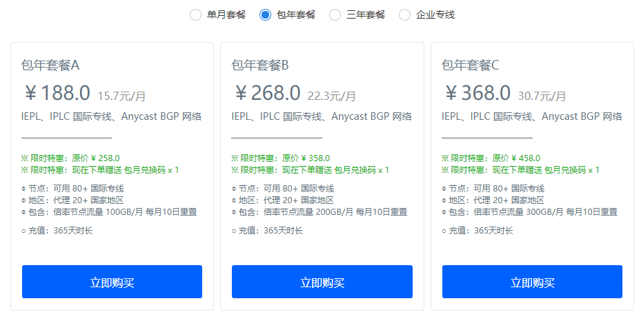
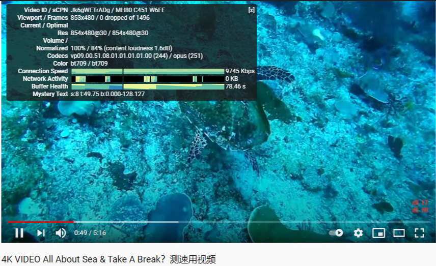

# 稳定好用的手机和电脑梯子推荐，兼容ios-安卓-windows-mac等系统，科学上网一键搞定

近段时间，受各方面因素影响，一些往常比较[好用的机场梯子](https://www.taoxinbi.com/article/43932.html)软件陆续停止了服务，对于有重度科学上网需求的用户而言，产生了不小的影响，不过依然有一批电脑以及**手机梯子**在继续提供服务，而且比以往更加稳定好用，在这里晴天给大家盘点下这几个梯子的基本情况。

因为我自己也是个重度机场梯子用户，平时查资料以及做功课都少不了上外网寻求帮助，经手的梯子软件数不胜数，就算刨去那些差强人意的，只留下了几家又稳定又好用的梯子，数量依然不少，所以准备分期进行介绍和测评。

本期介绍的机场梯子软件，名为西部世界（Westworld），是一款全部线路皆为IEPL的高端性价比机场梯子。

### [点击访问机场梯子官网](https://xbsj4621.fun/i/art078)

末尾我会放上自己近期收集的一些免费ssr以及V2ray节点，都是亲测可以使用的。

## 一、适合手机以及pc的梯子，一些基本概况

西部世界这款梯子软件，根据我搜索网上资料后了解，是一家位于欧盟的机场服务商，网站主页可以切换中英双语，对于大陆用户比较友好，而且和Express 以及 Nord一样，都是比较早期的机场之一。他们网站会根据浏览器的设置，自动选择匹配的语言，当然你也可以点这里进行切换。

首次接触这款梯子，还是在汤不热上，那会儿汤不热是无数宅男心目中的圣地，我自然也不例外，偶然间刷到上面有博主在推，用了几次之后发现用来刷汤不热的视频速度是真的快，所以一直用到现在。

早期的西部世界后台以ssr节点为主力，目前也已经大部分更改为V2ray和Trojan节点，只保留了少部分ssr节点。

给我印象最深的一点，就是西部世界的耐久度比较高，前些年陆陆续续遇到过不断增强的GFW封锁，西部世界都是在第一时间进行更新和维护，基本能够保证不间断地提供畅通网络。

而且据我观察，西部世界也是业内最早推出Trojan节点的服务商之一，这个原因也促使我一直持续使用它，毕竟一款能够以用户为中心，不间断更新维护并且持久提供服务的机场提供商，肯定是值得信赖的。

西部世界的线路也一直在进行持续不断的优化，从最开始的直连线路，到后来的中转，再到最后的IPLC以及IEPL，使用体验这块儿一直在提升。

如果是碰巧手头没有一款**稳定好用的pc梯子**或者手机梯子，那么这款梯子软件肯定会给你惊喜，这也是我把西部世界放在第一期介绍的原因，稳定，好用，高速，高性价比，就是这款软件最具特色的一点。

## 二、pc梯子的后台节点线路介绍

大部分用户对于使用梯子的日常需求应该是手机端，比如苹果或者是安卓系统，但是也有不少用户的需求重点在pc端，比如windows系统以及mac系统，当然还有少量Linux系统的用户，不管怎么说，大家对于一个梯子软件的主要需求，肯定还是集中在稳定高效以及速度快这几个点上，如果是游戏玩家，那对延迟这一块儿也有相应的需求。

西部世界由于早期用的直连线路，走的是公网，经常会受到晚高峰网络拥堵的影响，不过后来陆续上了IEPL专线以及IPLC专线后，这种影响就不复存在了，目前的使用情况来看，全天24小时都能够保证网络的畅通稳定。

后台也有流媒体专用的视频节点，能够解锁Netflix以及Fulu等流媒体，并且不用经过公网，所以看视频的速度真的很快。

后台的节点数量有接近一百条，覆盖各个地区，这些节点可以配合第三方客户端，比如Shadowrocket（小火箭），ClashX，V2rayN等使用，能够单一节点手动添加，或者用他们后台的订阅链接进行批量添加，当然我更推荐的方式是下载他们后台相应的客户端，只需要登陆，选择节点就能够使用。

## 三、手机梯子使用时一些比较高速的节点

不管你使用的是电脑、苹果手机还是安卓手机，都可以在这个梯子软件后台找到相应的客户端下载。

以安卓手机举例子，如果你要下载安卓梯子客户端，可以在后台点击客户端下载，然后选择Andriod，在下载界面当中不仅有下载链接以及二维码，同时还提供了详细的使用教程，只要花一两分钟过一遍，就能轻松上手安卓客户端的使用，非常方便。

就我自己长期使用体验看来，后台的日本以及香港节点速度是非常快，其次就是美国节点，速度也不错，接着就是商务节点。当然根据每个人的运营商网络不同，这个选择可能会有些许的差异，大家可以都试一下，选择适合自己的线路就行。

对于有打外服游戏需求的用户，可以选择他们后台的游戏专用节点，延迟低网速快，已经亲测完全能够满足游戏需求，甚至略有惊喜。

## 四、好用的机场梯子套餐情况

这款梯子软件的定价在所有同类型机场当中并不算贵，甚至偏低，正因为如此，才显得它性价比高，最基本的包月套餐是25RMB一个月，然后是进阶版的包年套餐，188一年，当然包年套餐下属还有三种不同的流量套餐，基本都有好几百个G，足够个人使用。

因为所有线路都是IEPL节点，对比这个定价，并不算贵，在使用体验以及速度还有稳定性方面，远超所支付的价格，最重要的是专线可以无视特殊时期的封锁，持续使用。

## 五、梯子软件的相关测速

实践出真知，任何华丽的辞藻如果没有以事实为依据，都是耍流氓。所以给大家直接放上这款机场梯子的真实测速截图，测速选用平台为Youtube，直接以4K超高清视频观看为例，配合本地网络环境：电信宽带100M，节点选择为香港IEPL专线节点。

从测速结果来看，4K视频能够做到超前缓冲，如果是我们日常观看视频，基本会选择1080p左右的清晰度，那么缓冲速度会更快。

## 六、三条免费ssr节点+三条免费V2ray节点分享

这几条免费ssr节点和V2ray节点都是我自己采集自网络以及电报群当中的资源，时不时会使用一下，有需要的朋友可以自取。

### 免费ssr节点：

ssr://enguaGsuMDEuMDIueGZqLW5vZGUudG9wOjIzMzM6YXV0aF9hZXMxMjhfbWQ1OnJjNC1tZDU6aHR0cF9zaW1wbGU6Um01bk5YVTRSSGsvP29iZnNwYXJhbT1ZelZsT0RreU5UQXhOaTVxWkM1b2F3JnByb3RvcGFyYW09TWpVd01UWTZPRk0zY1RCbyZyZW1hcmtzPVEwNHRSMFF0NWJtXzVMaWNMVEU0TXkxaGJHbDVkVzR1WTI5dElGTlRVZyZncm91cD1RMmhoY214bGN5QllkUQ

ssr://MTE3LjI4LjI0My4xNjk6ODMzMzpvcmlnaW46cmM0LW1kNTpwbGFpbjpjR0Z6YzJaM01uaHpOR1VoLz9vYmZzcGFyYW09JnByb3RvcGFyYW09JnJlbWFya3M9NTctNzVhS1o1WVdhWm1GdWNXbGhibWRrWVc1bkxtTnZiUSY9Jmdyb3VwPTU3LTc1YUtaNVlXYVptRnVjV2xoYm1ka1lXNW5MbU52YlEmPWNISnZlSGx3YjI5c2MzTXVhR1Z5YjJ0MVlYQndMbU52YlE

ssr://MTE3LjI4LjI0My4xNjk6ODMzMzpvcmlnaW46cmM0LW1kNTpwbGFpbjpjR0Z6YzJaM01uaHpOR1VoLz9vYmZzcGFyYW09JnByb3RvcGFyYW09ZEM1dFpTOVRVMUpUVlVJJnJlbWFya3M9NTctNzVhS1o1WVdhWm1GdWNXbGhibWRrWVc1bkxtTnZiUSY9Jmdyb3VwPTU3LTc1YUtaNVlXYVptRnVjV2xoYm1ka1lXNW5MbU52YlEmPWNISnZlSGx3YjI5c2MzTXVhR1Z5YjJ0MVlYQndMbU52YlE

### 免费V2ray节点：

vmess://eyJhZGQiOiIxMDQuMjYuMi4yOSIsImFpZCI6IjEiLCJob3N0IjoiZnJlZS5mcmxpLnh5eiIsImlkIjoiOWU2Y2VlZmYtMjU0Ni0zNjkwLWFjMDAtNmZjZGYzMWRlYzk0IiwibmV0Ijoid3MiLCJwYXRoIjoiL3k0NzUiLCJwb3J0IjoiNDQzIiwicHMiIDoi57+75aKZ5YWaZmFucWlhbmdkYW5nLmNvbSIsIiIgOiJDRE7lhaznm4roioLngrkg6auY6YCf6IqC54K5OiBodHRwczovL2Nsb3VkLmZybGEuZ2EiLCJzY3kiOiJhdXRvIiwic25pIjoiZnJlZS5mcmxpLnh5eiIsInRscyI6InRscyIsInR5cGUiOiIiLCJ2IjoiMiJ9

vmess://eyJhZGQiOiIxOC4xNzkuMjAuMTc4IiwiYWlkIjoiMiIsImhvc3QiOiJjb29hLnh5eiIsImlkIjoiOWU2Y2VlZmYtMjU0Ni0zNjkwLWFjMDAtNmZjZGYzMWRlYzk0IiwibmV0Ijoid3MiLCJwYXRoIjoiL3kyODQiLCJwb3J0IjoiNDQzIiwicHMiIDoi57+75aKZ5YWaZmFucWlhbmdkYW5nLmNvbSIsIiIgOiLml6XmnKwg5YWs55uK6IqC54K5ICDpq5jpgJ/oioLngrk6IGh0dHBzOi8vY2xvdWQuZnJsYS5nYSIsInNjeSI6ImF1dG8iLCJzbmkiOiJjb29hLnh5eiIsInRscyI6InRscyIsInR5cGUiOiIiLCJ2IjoiMiJ9

vmess://eyJ2IjoyLCJhZGQiOiJydW1sLmpqeXVuLnJlbiIsInBvcnQiOiI4OCIsImlkIjoiZDU5ZThkNTQtNDkxNC00YTA3LTgwZGYtMzNmZTJhNzc3NmFjIiwiYWlkIjoiMTAiLCJuZXQiOiJ3cyIsInBzIiA6Iue/u+WimeWFmmZhbnFpYW5nZGFuZy5jb20iLCIiIDoiW+Wimeinkl0g6auY6YCfSlkt5L+E572X5pavQSDljp/nlJ8iLCJ0eXBlIjoibm9uZSIsImhvc3QiOiIiLCJwYXRoIjoiXC9qanl1biIsInRscyI6IiIsInNuaSI6IiJ9
